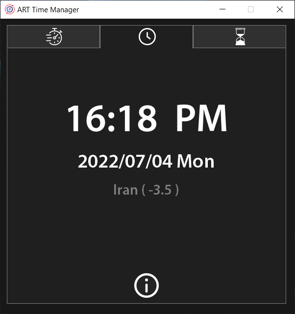
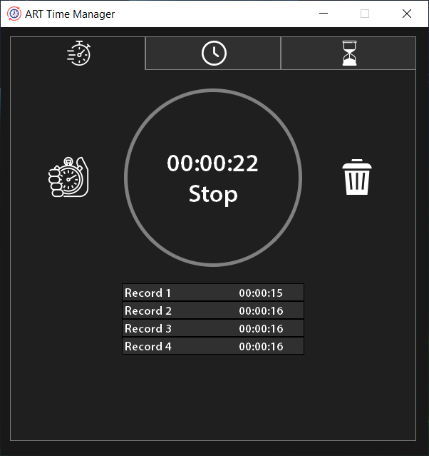
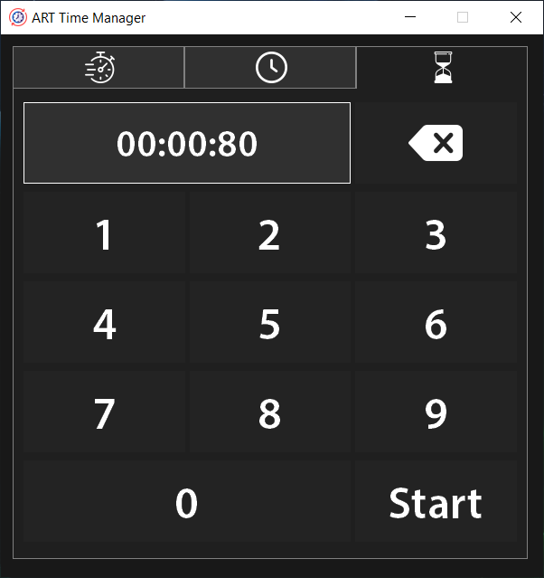
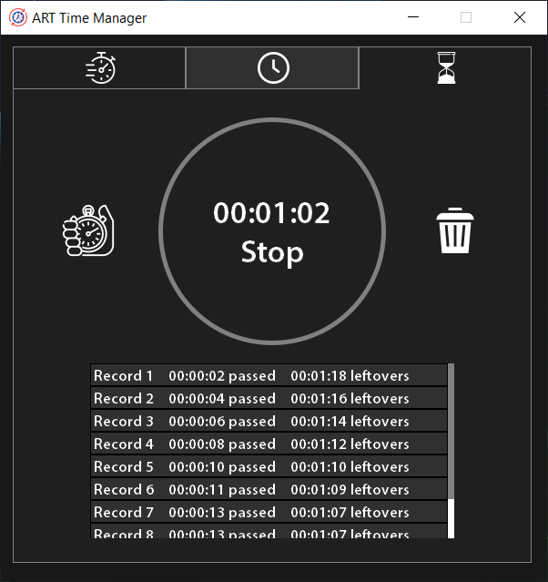

# ART-Time-Manager

This application "ART Time Manager" is a program for time management and has features such as timer, countdown timer, and also displays the date, time, and time zone.

It is also designed with PyQt5 and developed by "Amirreza Tavallaei".

For use this you should install PyQt5 module in Python.

For this you should write this code in Command Prompt:

```bash
pip install PyQt5
```

# ScreenShot

Time Menu
</img>

Timer Menu
</img>

CountDown Menu
</img>
</img>
